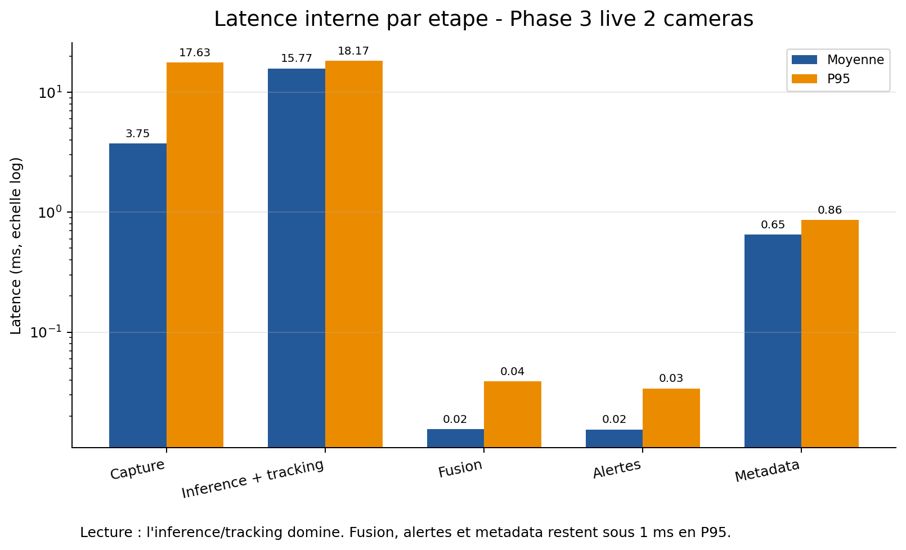
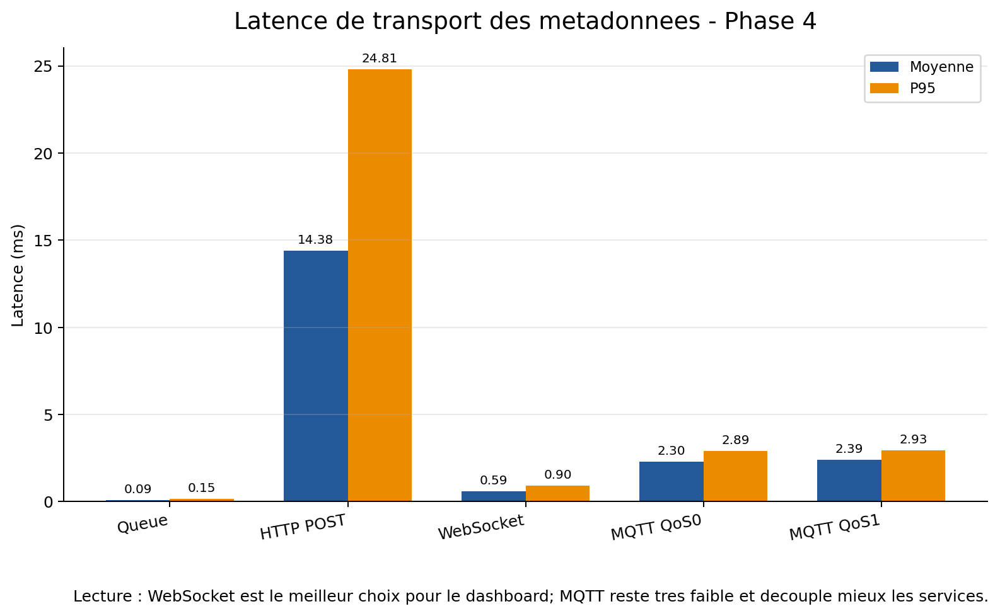
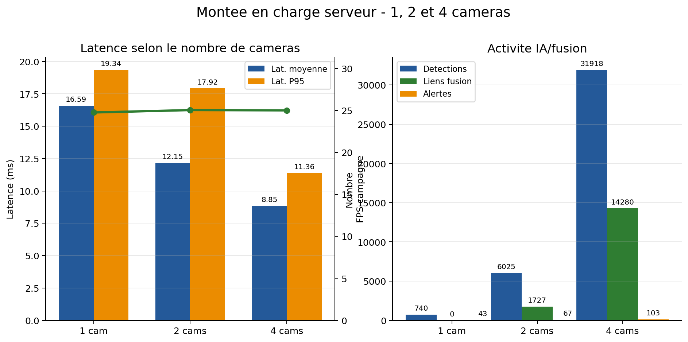
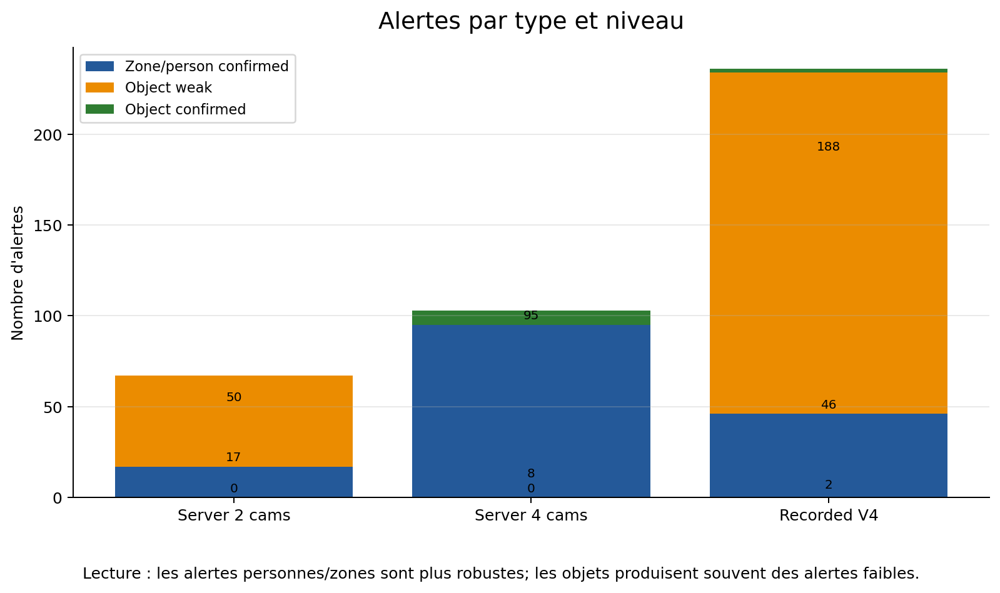
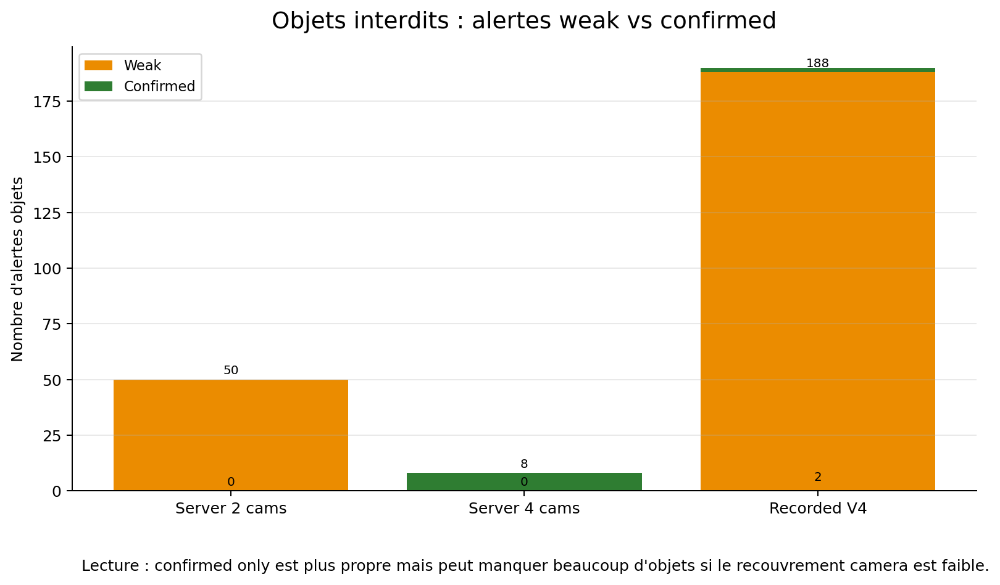
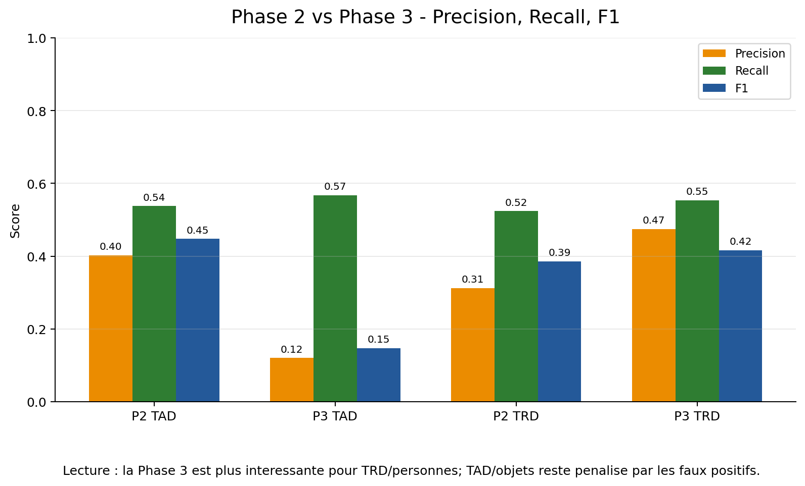
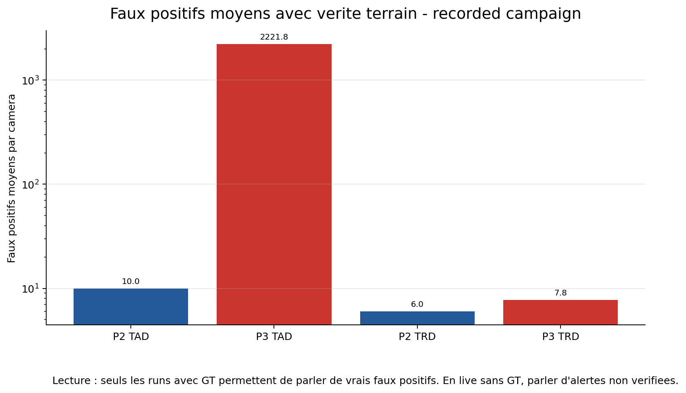

# Figures Phase 3 / Phase 4 - 2026-06-23

Ces figures sont generees depuis les resultats locaux disponibles avec :

```powershell
python scripts\generate_phase3_phase4_figures.py
```

Depuis le dossier parent `BenchmarkingAI`, la commande equivalente est :

```powershell
python STAGELIST3N-FusionCam\scripts\generate_phase3_phase4_figures.py
```

## 1. Latence interne par etape



Message a retenir : l'inference/tracking domine la latence. La fusion, la generation d'alertes et l'ecriture des metadonnees sont tres faibles.

## 2. Transport des metadonnees



Message a retenir : WebSocket est le plus adapte au dashboard temps reel. MQTT reste tres bon pour une architecture distribuee. HTTP POST est plus variable.

## 3. Montee en charge 1 / 2 / 4 cameras



Message a retenir : le serveur reste exploitable en 4 cameras. La latence p95 reste faible et les liens de fusion augmentent fortement avec le multi-camera.

## 4. Alertes par type



Message a retenir : les alertes personnes/zones sont plus robustes que les alertes objets. Les objets produisent souvent des alertes faibles.

## 5. Objets weak vs confirmed



Message a retenir : `confirmed only` est plus propre, mais trop strict quand les objets ne sont pas visibles par plusieurs cameras. Le mode `weak + confirmed` est utile pour analyser les objets sans tout manquer.

## 6. Phase 2 vs Phase 3 - Scores



Message a retenir : la Phase 3 est plus interessante pour TRD/personnes. Pour TAD/objets, elle augmente la sensibilite mais degrade la precision.

## 7. Faux positifs avec verite terrain



Message a retenir : les faux positifs doivent etre presentes seulement sur les runs avec GT. En live sans annotation, il faut parler d'alertes non verifiees ou de volume d'alertes.

## Figures conseillees pour les diapos

Pour une presentation courte :

1. `01_latence_interne_par_etape.png`
2. `02_transport_metadata_http_websocket_mqtt.png`
3. `03_montee_charge_1_2_4_cameras.png`
4. `06_phase2_vs_phase3_scores.png`
5. `07_faux_positifs_phase2_phase3_gt.png`

Pour une presentation plus complete, ajouter :

6. `04_alertes_par_type.png`
7. `05_objets_weak_vs_confirmed.png`
