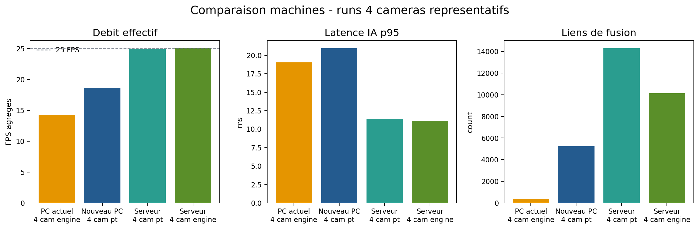
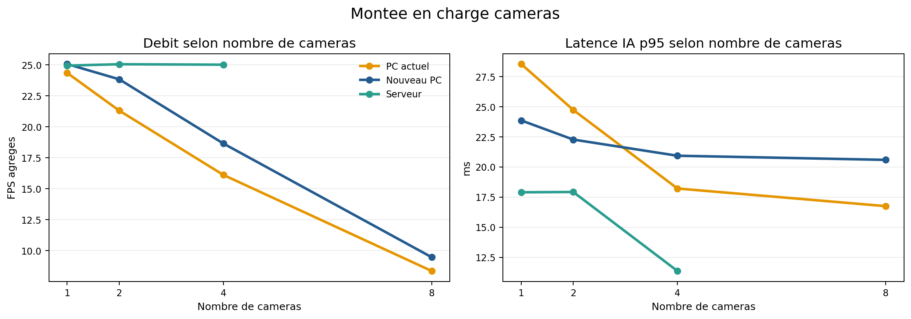
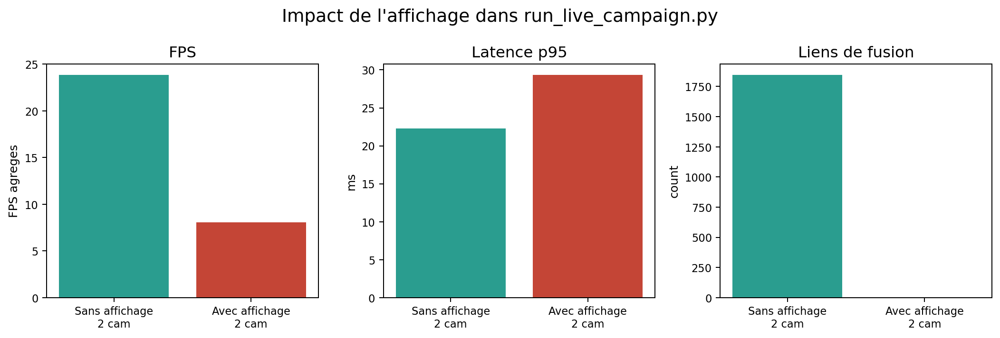
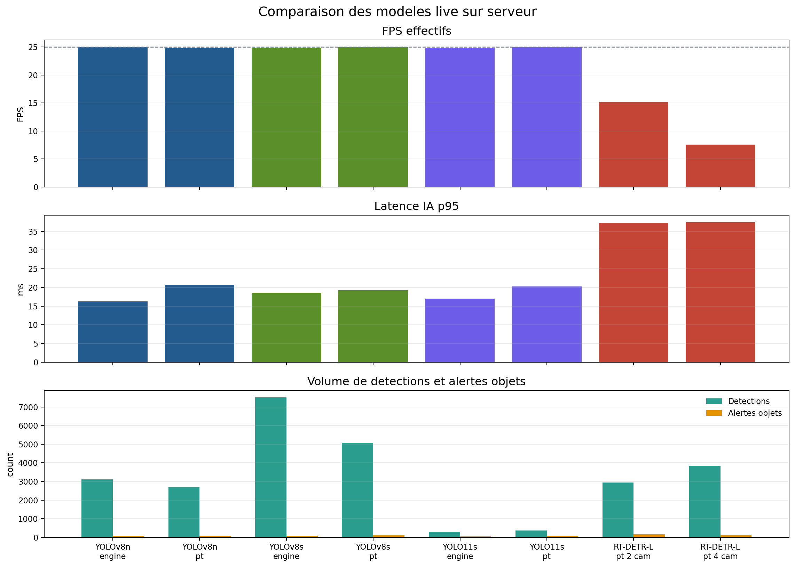
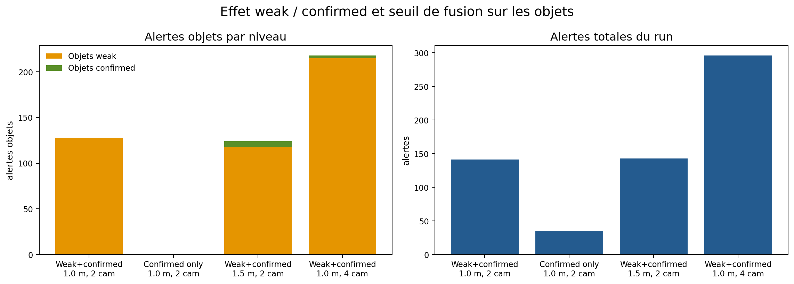
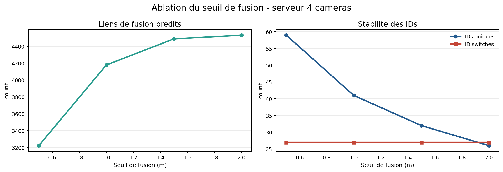
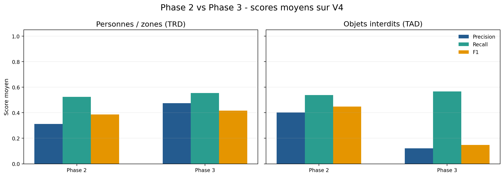
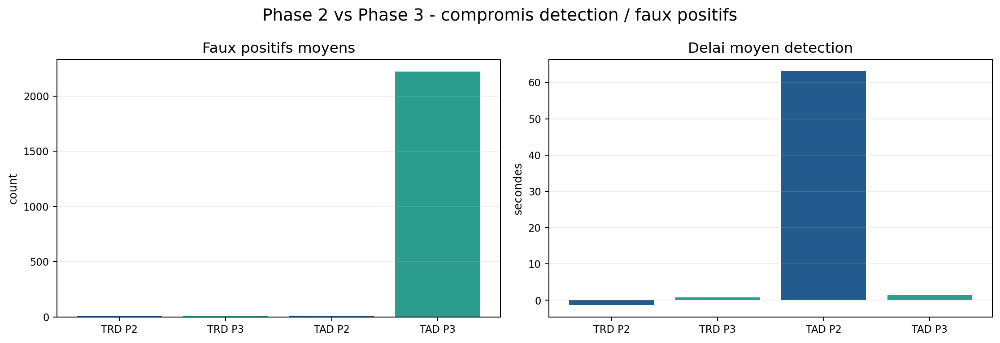

# Graphiques reunion 2026-06-12

Ces figures sont generees a partir des resultats live consolides de la semaine :

- resultats du PC principal ;
- resultats du nouveau PC ;
- resultats serveur ;
- comparaison Phase 2 / Phase 3 V4 ;
- tests modeles et objets sur serveur.

## 1. Comparaison machines 4 cameras

Message a retenir :

- le serveur est le meilleur candidat pour 4 cameras ;
- il garde environ 25 FPS avec une latence p95 tres faible ;
- le nouveau PC est utilisable mais moins stable ;
- le PC principal reste limite pour du live multi-camera.

## 2. Montee en charge cameras

Message a retenir :

- le PC principal chute fortement quand on augmente le nombre de cameras ;
- le nouveau PC tient mieux 2 a 4 cameras, mais 8 cameras ne sont pas validees ;
- le serveur reste stable sur 1, 2 et 4 cameras ;
- il manque encore un vrai run 8 cameras serveur exploitable.

## 3. Impact de l'affichage

Message a retenir :

- l'affichage dans `run_live_campaign.py` degrade fortement les performances ;
- le FPS chute fortement ;
- les liens de fusion disparaissent dans le run avec affichage ;
- cela justifie l'architecture separee : IA sans affichage, video affichee ailleurs.

## 4. Comparaison des modeles sur serveur

Message a retenir :

- `yolov8s fp32_engine` est le meilleur compromis detection / latence ;
- `yolov8n fp32_engine` est un bon fallback rapide ;
- `yolo11s` detecte beaucoup moins dans les conditions testees ;
- `rtdetr-l pt` est interessant scientifiquement mais trop lent pour du live multi-camera ;
- `rtdetr-l engine` n'est pas retenu car il est instable.

## 5. Objets weak / confirmed

Message a retenir :

- `weak + confirmed` detecte beaucoup d'objets mais genere beaucoup d'alertes faibles ;
- `confirmed only` est trop strict dans les conditions actuelles ;
- augmenter le seuil a 1.5 m peut augmenter les confirmations, mais demande une verification de calibration ;
- les objets restent la partie la plus fragile du systeme.

## 6. Ablation du seuil de fusion

Message a retenir :

- plus le seuil augmente, plus le systeme fusionne ;
- 0.5 m est probablement trop strict ;
- 1.0 m est le seuil par defaut le plus defendable ;
- 1.5 m peut etre discute pour les objets ;
- 2.0 m risque de creer des associations douteuses.

## 7. Phase 2 vs Phase 3

Message a retenir :

- pour les personnes/zones, la Phase 3 ameliore precision et F1 ;
- pour les objets, la Phase 3 conserve un bon recall mais perd en precision a cause des alertes faibles ;
- cela confirme que la Phase 3 est plus mature pour les personnes/zones que pour les objets.

## 8. Phase 2 vs Phase 3 : faux positifs et delais

Message a retenir :

- la Phase 3 detecte les objets beaucoup plus rapidement ;
- mais elle genere beaucoup plus de faux positifs objets ;
- le compromis sensibilite / precision doit etre presente clairement.

## Utilisation conseillee dans la presentation

Pour une presentation courte aux tuteurs :

1. `01_comparaison_machines_4cam.png`
2. `04_comparaison_modeles_serveur.png`
3. `07_phase2_vs_phase3_scores.png`
4. `05_objets_weak_confirmed.png`
5. `06_ablation_seuil_fusion.png`
6. `03_impact_affichage.png`

Ces six figures suffisent pour raconter l'histoire :

> La Phase 3 apporte une vraie valeur, le serveur est la bonne plateforme, `yolov8s fp32_engine` est le meilleur compromis, les objets restent difficiles, et l'architecture finale doit separer video / IA / metadonnees.
